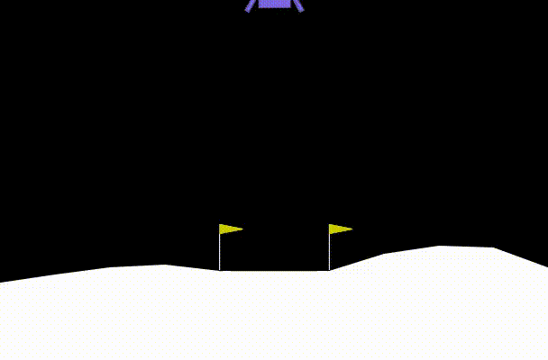

# Deep Q-Learning for Lunar Landing

## Overview

This project demonstrates the application of Deep Q-Learning to solve the Lunar Lander environment from OpenAI Gym. The goal is to train an agent that can successfully land a spacecraft on the lunar surface. The code includes the neural network architecture, experience replay mechanism, and training loop.

## Requirements

- Python 3.x
- PyTorch
- Gymnasium
- NumPy

## Code Structure

- **Part 0:** Installs necessary packages and imports libraries.
- **Part 1:** Defines the neural network architecture for the DQN agent.
- **Part 2:** Sets up the Lunar Lander environment, initializes hyperparameters, implements experience replay, and trains the DQN agent.
- **Part 3:** Visualizes the trained agent's performance by generating and displaying a video of its gameplay.

## Results

The trained DQN agent achieves an average score of 300 over 100 episodes, successfully solving the Lunar Lander environment.

## Contributing

Contributions are welcome! Feel free to open issues or pull requests for bug fixes, enhancements, or new features.

## License

This project is licensed under the [insert license name] License.
